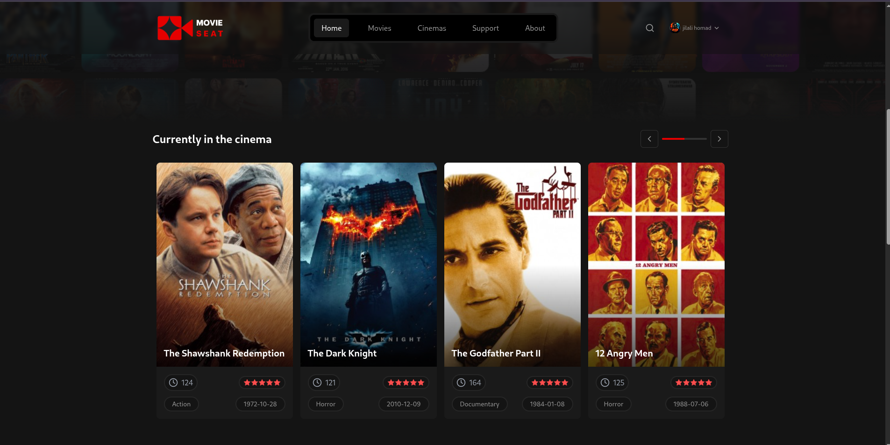
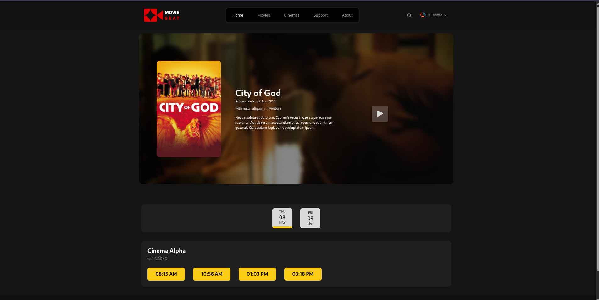

# MovieSeat - front-end

Le frontend de MovieSeat est une application Single Page construite avec Vue 3, Vite et Tailwind CSS. Il consomme l’API Laravel pour offrir une interface utilisateur réactive et moderne.

---

## Table des matières

* [Fonctionnalités](#fonctionnalités)
* [Structure du projet](#structure-du-projet)
* [Prérequis](#prérequis)
* [Installation](#installation)
* [Configuration de l'environnement](#configuration-de-lenvironnement)
* [Démarrage](#démarrage)
* [Déploiement](#déploiement)
* [Licence](#licence)

---

## Fonctionnalités

* Affichage des films (carrousel, liste)
* Sélection interactive des sièges
* Flux en temps réel pour voir les sièges réservés ou bloqués
* Gestion des utilisateurs (inscription, connexion)
* Dashboard Admin pour CRUD films, salles, séances
* Mise en page responsive pour mobile et desktop

---

## Structure du projet

```
repo/
├─ ws/
│  ├─ handlers/
│  │  └─ seatHandler.js
│  └─ server.js
├─ public/
│  └─ index.html
├─ src/
│  ├─ assets/
│  ├─ components/
│  ├─ views/
│  ├─ router/
│  ├─ store/
│  └─ App.vue
├─ .env.example
└─ vite.config.js
```

---

## Prérequis

* Node.js 16+
* npm ou yarn
* Redis (utilisé pour stocker les sièges pré-réservés)

---

## Gestion en temps réel

* Socket.IO pour diffusion des événements de réservation et de blocage de sièges
* Redis comme broker de messages
---
## Installation

```bash
# Cloner le dépôt frontend
git clone https://github.com/Tawdi/fil_rouge-frontend.git
cd fil_rouge-frontend

# Installer les dépendances
npm install
# pour websocket
cd _ws/
npm install

```

---

## Configuration de l'environnement

Copiez `.env.example` en `.env` et ajustez :

```env
VITE_API_BASE_URL=http://127.0.0.1:8000/api
VITE_STORAGE_URL=http://127.0.0.1:8000/storage/
```
et pour `_ws/.env` :
```env
PORT=9999
FRONTEND_URL=http://localhost:3003
REDIS_HOST=127.0.0.1
REDIS_PORT=6379
```
---

## Démarrage

```bash
# Pour vite 
npm run dev

# et pour  websocket server 
cd _ws/
npm run dev
```

---
## Aperçu de l'application

<p align="center">
  
  
</p>

---

* Sélection des sièges


---
* Dashboard

<p align="center">
  
  
</p>
---

## Licence

Ce projet est sous licence MIT. Voir le fichier `LICENSE` pour plus de détails.

